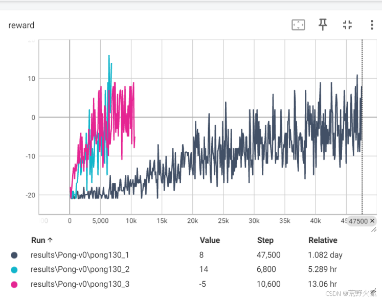
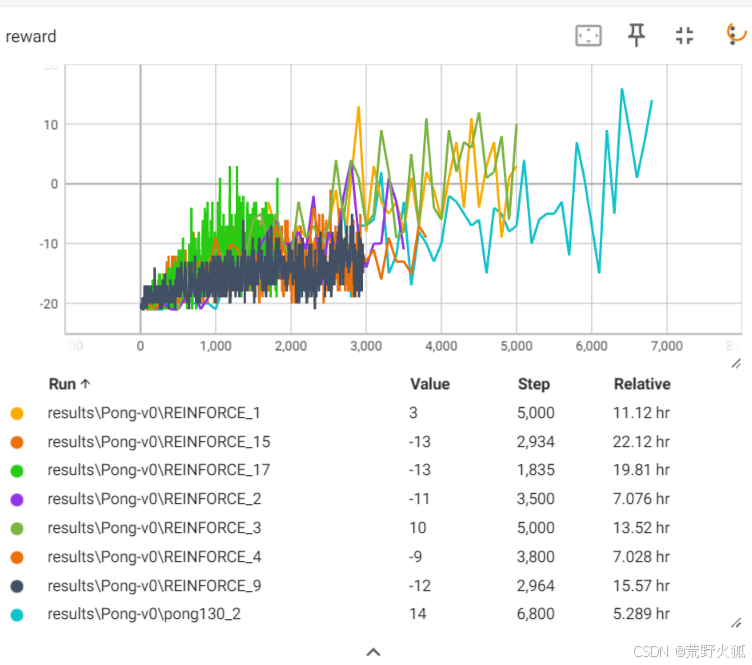
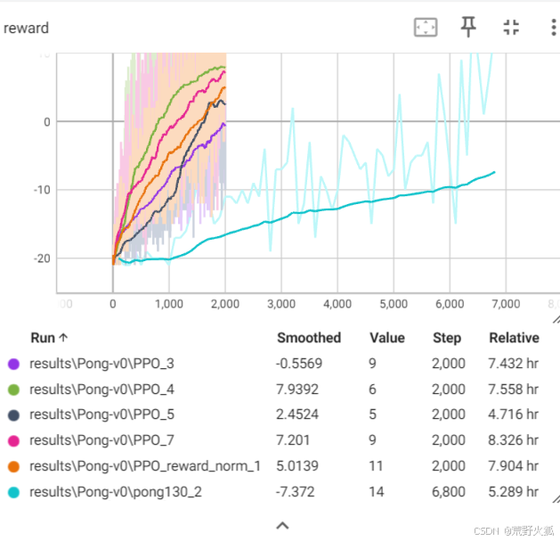
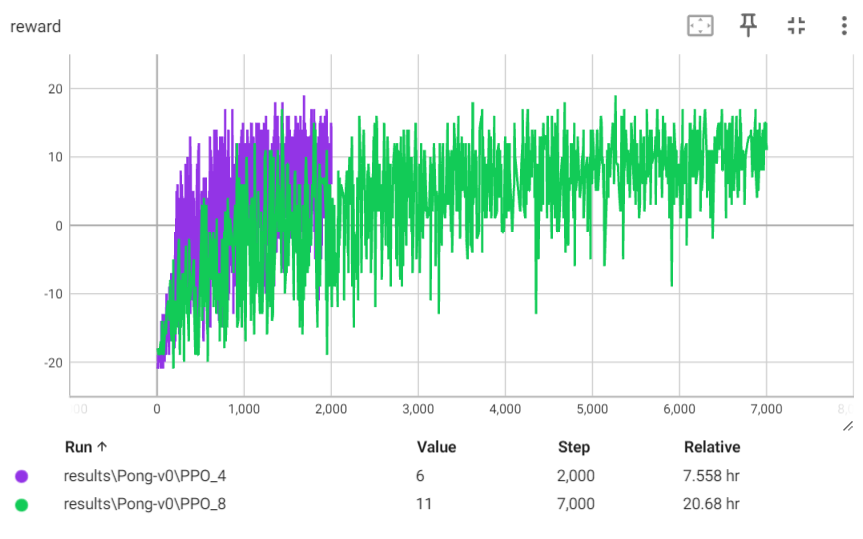

使用atari中的pong游戏作为第一个游戏,从而得到atari像素游戏的通解。  
具体解释见：[【游戏ai】从强化学习开始自学游戏ai-1非侵入式玩像素小鸟的博客的第一部分](https://blog.csdn.net/weixin_56760882/article/details/145848700)


可以进行训练的代码:

参考：https://gist.github.com/karpathy/a4166c7fe253700972fcbc77e4ea32c5   
改成python3.x版本实现
```
pong130.py
pong130_op.py
评估代码
eval_pong130.py
```
效果：  
  
gif在results\Pong-v0\pong130_2\evaluate.gif中  


<!--  -->

---
这里的REINFORCE和PPO算法均修改自自写库：  [https://github.com/wild-firefox/FreeRL](https://github.com/wild-firefox/FreeRL)  
改成REINFORCE算法实现 
```
REINFORCE.py
```
效果：  
  
改成PPO算法实现
```
PPO_atari.py
评估代码
eval_ppo_atari.py
```
效果：  


PPO_8训练完效果如下：  


--2025.4.27更新--
加入`PPO_atari.py`的评估代码`eval_ppo_atari.py`    

发现之前PPO训练时是固定随机种子的，导致评估时效果不好，这里PPO_8的随机种子不固定，训练效果如下：  

