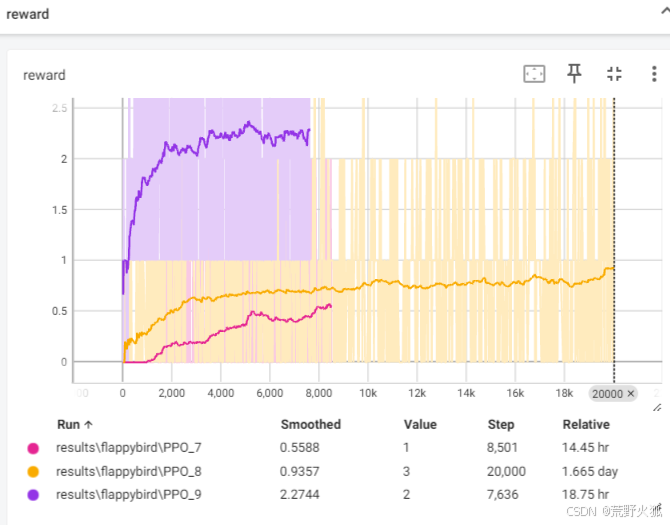

#
详细的的使用方法见：[https://blog.csdn.net/weixin_56760882/article/details/145848700](https://blog.csdn.net/weixin_56760882/article/details/145848700)

## 如何使用
`默认代码界面不要遮住游戏界面，游戏界面缩小放左上角。`  
1.了解当前显示器分辨率和显示中的缩放大小。（缩放大小写入preparation.py的scaling_size里）  
2.在`单人游戏j界面上`运行`preparation.py`（此时鼠标不要乱动），看是否框住了`特征提取（3）`这几处提及的图片，  
（若没有框住或报错，则直接截取当前屏幕上的图替换images文件夹里的这几处照片。
然后将得到的结果粘贴替换环境`env_flappybird.py`代码的最上方代码,也需要替换`define_keys.ipynb`上方相关的值,如下所示）
  

3.在`define_keys.ipynb`的第一部分总结尝试得出`get_white_pixel`中img的行数，和start的位置。若发现也可以达到白色像素点变化 / start灰度值的开始和结束的灰度值不一致 ，则可以不变。
在第二部分可以裁剪出自己的obs.shape 然后将其替换掉`PPO_atari.py`中的值。

在第三部分是简单的尝试运行demo，也可以看到输入的obs的图片是什么样的。

4.上述都成功的话，则可以运行`PPO_atari.py`的程序了。

如遇紧急情况，在键盘上按一下’t‘即可暂停。此值可在`io_utils.py`上改，紧急暂停后，还得必须将鼠标放入游戏界面的下半土地部分（防止遮挡关键部分），再按't'来重新启动程序。

训练结果展示，支持使用tensorboard来展示，数据保存在/results/环境名/算法名 下。

tensorboard --logdir==数据位置

5.最后可以使用`eval_flappybird.py`来评估最后的效果。

我这里评估了100次游戏，最终的平均得分为0.95。  

`注意：每次训练时需要重复第2步以保证框选正确，若出现obs对不上的情况，则需要检测第3步（基本第三步不需要检查）`

收敛效果如下：  
  
 
测试视频：[https://wild-firefox.github.io/projects](https://wild-firefox.github.io/projects)