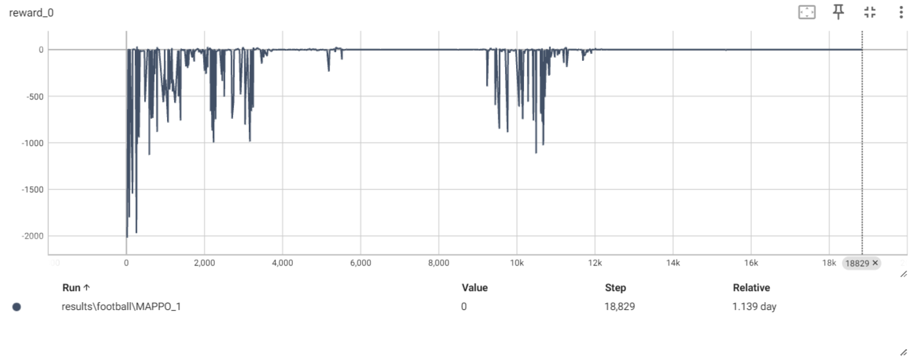

使用FreeRL代码来实现游戏ai/开发项目

具体项目见详情，见各项目的readme.md文件

FreeRL : [https://github.com/wild-firefox/FreeRL](https://github.com/wild-firefox/FreeRL) 

项目详情页：https://wild-firefox.github.io/projects

项目1：first_game_pong 效果  
  

项目2：play_FlappyBird 效果  

<video controls width="600">
    <source src="play_FlappyBird/videos/flappybird_test.mp4" type="video/mp4">
    Your browser does not support the video tag.
</video>

项目3 IPPO_for_pong 效果  

 

项目4 RL_for_football_lottery 效果  

